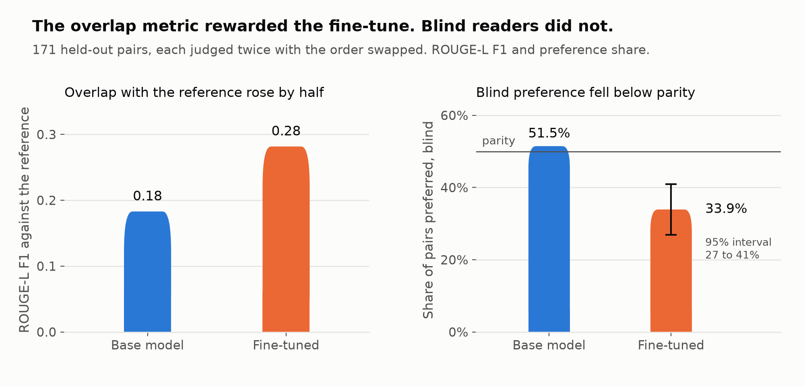
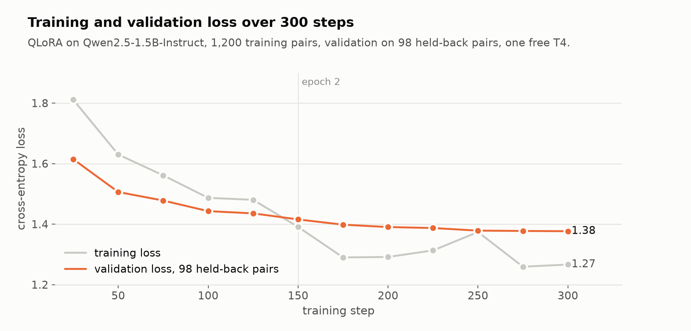
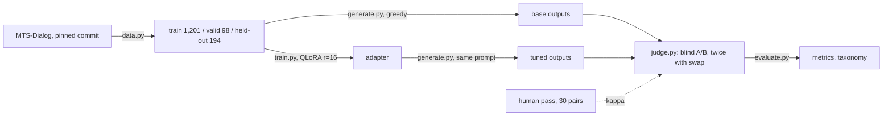

# lora-eval-lab

[](https://github.com/J-Jurza/lora-eval-lab/actions/workflows/tests.yml)
[](LICENSE)
[](pyproject.toml)

A small open-weight model, LoRA fine-tuned on one clinical task and **evaluated blind
against its own base model**: blinded A/B judging with a position-swap control, a human
calibration pass, a bootstrap interval, and a hand-labelled failure taxonomy. The
evaluation is the deliverable; the model is the excuse to build it. Companion to
[rag-eval-lab](https://github.com/J-Jurza/rag-eval-lab).

- **Write-up:** [Did your fine-tune actually get better? The metric you trust cannot tell you](https://medium.com/@honzj/did-your-fine-tune-actually-get-better-the-metric-you-trust-cannot-tell-you-a980f91c7266) (Medium, 5 min)
- **Walkthrough:** [WALKTHROUGH.md](WALKTHROUGH.md), every step in full, three depths of explanation, the numbers, and where each piece lives in the code
- **Process and decisions:** [PROCESS.md](PROCESS.md) (the steps in plain language), [DECISIONS.md](DECISIONS.md) (every choice, with the alternative rejected)

## Result

The base model won. Over 171 held-out pairs kept after the swap check, the fine-tuned
model was preferred in **33.9%** (95% CI 26.9 to 40.9), the base model in **51.5%**,
tie 14.6%. The interval excludes 50%, so this is not parity: fine-tuning made the notes
worse as judged blind. Faithfulness is the dimension that fell (4.42 to 4.05); ROUGE-L
rose (0.18 to 0.28) at the same time, which is why ROUGE is a sanity check here and not
a result.



| Dimension (1 to 5) | Base | Tuned | Difference | 95% CI |
|---|---|---|---|---|
| Faithfulness | 4.42 | 4.05 | **-0.37** | -0.63 to -0.11 |
| Completeness | 4.25 | 4.01 | -0.23 | -0.45 to 0.00 |
| Format | 4.51 | 4.42 | -0.09 | -0.29 to +0.11 |
| Concision | 4.45 | 4.37 | -0.08 | -0.27 to +0.11 |

Of the 88 pairs the fine-tune lost, 41 contained a fact the patient never said and 35
left a relevant fact out. The cause is in the data: the reference notes were written
before the conversations and contain specifics the conversations lack, so training on
them rewards invention. Full tables, per-section rates, the judge's position-bias count,
human-judge agreement (kappa 0.41) and the taxonomy are in
[results/metrics.md](results/metrics.md) and [WALKTHROUGH.md](WALKTHROUGH.md).



## Setup

| | |
|---|---|
| Task | Doctor-patient dialogue to one clinical note section, on [MTS-Dialog](https://github.com/abachaa/MTS-Dialog) (CC BY 4.0, 1,701 pairs, 20 section types) |
| Model | [Qwen2.5-1.5B-Instruct](https://huggingface.co/Qwen/Qwen2.5-1.5B-Instruct), 4-bit QLoRA via Unsloth, one free Colab T4, 15 minutes |
| Split | Official split; held-out ids frozen before training; duplicate checks on dialogue and note text (6 rows removed, recorded) |
| Judge | Gemini Flash with a written rubric, every pair judged twice with A/B swapped, verdicts kept only when consistent |
| Human pass | 30 pairs scored blind by the author before the judge ran |
| Metrics | Win rate with a bootstrap 95% CI, per-dimension and per-section scores, ROUGE-L, Cohen's kappa, failure taxonomy; all hand-rolled with hand-computed tests |



## Quickstart

Everything except training and generation runs on CPU.

```bash
python3.12 -m venv .venv && source .venv/bin/activate
pip install -e ".[dev]"
python -m lora_eval_lab.data --download --stats   # pinned CSVs, checksums verified
pytest -q                                          # 40 pure-logic tests, no model, no API
python -m lora_eval_lab.evaluate                   # results/metrics.md from committed verdicts
```

The two GPU steps run in one Colab notebook, `notebooks/lora_eval_lab_colab.ipynb`
(T4, about an hour). Judging needs a Gemini key in `.env` (see `.env.example`):

```bash
pip install -e ".[judge]"
python -m lora_eval_lab.judge --human      # 30-pair human pack (refuses to overwrite a filled one)
python -m lora_eval_lab.judge --judge      # LLM judge, twice per pair, resumable
python -m lora_eval_lab.evaluate --taxonomy   # losses.md for hand labelling (refuses to overwrite a labelled one)
```

## Repository map

```
src/lora_eval_lab/
  data.py       pinned fetch, official split, duplicate checks, frozen held-out ids, chat format
  generate.py   greedy batched generation, base or adapter, prompt fingerprint per row
  train.py      QLoRA via Unsloth, assistant-only loss, best-validation checkpoint
  judge.py      blinding key, human pack, Gemini judge with swap, resumable verdicts
  evaluate.py   swap filter, bootstrap CI, dimensions, sections, ROUGE-L, kappa, taxonomy
eval/           rubric.md · judge_prompt.md · holdout_ids.json
notebooks/      the Colab notebook for the two GPU steps
results/        generations, key, verdicts, human pack, losses, metrics (committed)
tests/          40 tests with hand-computed expected values
tools/          make_figures.py, the charts from results/
docs/           the figures
WALKTHROUGH.md  every step in full, the long-form companion to the write-up
```

## Design decisions

The full record, each with the alternative rejected, is [DECISIONS.md](DECISIONS.md).

| Decision | Why |
|---|---|
| Official split, duplicate checks on dialogue and note text, ids frozen in the repo | Leakage is the commonest silent error; one test row was a copy of a training dialogue and five shared a source note |
| Zero-shot base as the control, generated before training | The comparison needs a "before" taken with the same settings |
| Greedy decoding, identical for both models | Repeatable outputs that a reader can check |
| Every pair judged twice with A/B swapped, kept only when consistent | Position bias is real and measurable: all 23 dropped pairs favoured the left slot |
| Human blind pass before the judge runs | Independence of the human scores |
| Metrics hand-rolled with hand-computed tests | The arithmetic is the deliverable and must be checkable in one file |
| Adapter on Drive, not committed | Tens of MB of binary in a docs-and-code repo |

## Limitations

- One LLM judge and one human who is not a clinician. Agreement is reported (kappa 0.41); neither is validated against clinicians.
- Blinding and swapping do not remove fluency bias; the rubric's "faithfulness outranks everything" and the taxonomy are the only defences.
- MTS-Dialog's conversations were written to match existing notes, not recorded, so the task is cleaner than a real consultation.
- No hyperparameter search: one configuration, recorded.
- A prompted base model was the harder opponent than expected; a one-shot base and a retrain on cleaned targets are the planned part two.

## Honesty

Portfolio project, built in a weekend with Claude Code as the implementing agent and
reviewed line by line. The task, the evaluation design, the rubric and the decisions are
the author's. Nothing here is claimed as production work.

## Licence

MIT. MTS-Dialog is CC BY 4.0 (Ben Abacha et al., EACL 2023) and is fetched from its
source repository at a pinned commit, not stored here.
