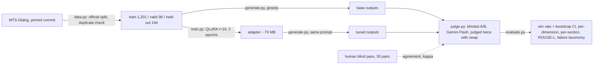

# lora-eval-lab

A small open-weight language model, LoRA fine-tuned on one narrow clinical task, and
**evaluated blind** against its own base model. Companion to
[rag-eval-lab](https://github.com/J-Jurza/rag-eval-lab): same organising idea, that the
evaluation is the deliverable and the model is the excuse to build it.

**Task:** doctor-patient dialogue to clinical note section (the ambient-scribe problem), on
the public [MTS-Dialog](https://github.com/abachaa/MTS-Dialog) dataset (CC BY 4.0, 1,701
dialogue-note pairs across 20 section types).
**Model:** [Qwen2.5-1.5B-Instruct](https://huggingface.co/Qwen/Qwen2.5-1.5B-Instruct),
4-bit QLoRA on a free Colab T4.
**The point:** did the fine-tune make the notes *better*, judged blind, side by side, with a
rubric and a failure taxonomy? Not "did the loss go down".

## Pipeline



## Results

Run on 29 to 30 August 2026. 194 held-out pairs judged twice each with A/B swapped; 171 kept
after the swap check. Full tables in `results/metrics.md`.

**The base model wins.** The tuned model was preferred in **33.9%** of kept pairs (95% CI
26.9 to 40.9), the base model in 51.5%, tie 14.6%. The interval excludes 50%, so this is
not parity: fine-tuning made the notes worse as judged blind against the rubric. Counting
the 23 dropped pairs as ties: tuned 29.9%, base 45.4%.

**What got worse, and what did not:**

| Dimension (1 to 5) | Base | Tuned | Difference | 95% CI |
|---|---|---|---|---|
| Faithfulness | 4.42 | 4.05 | **-0.37** | -0.63 to -0.11 |
| Completeness | 4.25 | 4.01 | -0.23 | -0.45 to 0.00 |
| Format | 4.51 | 4.42 | -0.09 | -0.29 to +0.11 |
| Concision | 4.45 | 4.37 | -0.08 | -0.27 to +0.11 |

Faithfulness is the loss. Format, the thing fine-tuning was expected to fix, did not move
within its interval, because the base model already writes an acceptable note section
zero-shot and the tuned model learned the dataset's terse style at the cost of inventing
specifics the patient never said.

**ROUGE-L went the other way**: 0.183 base, 0.282 tuned. Overlap with the reference rose
by half while blind preference fell. This is the clearest illustration in the repo of why
ROUGE is a sanity check and not a result: the reference notes contain ages and dates the
dialogues do not, and the tuned model learned to produce text of that shape.

**Where:** History of Present Illness, the ambient-scribe section, 44 kept pairs: tuned
0.41 (CI 0.27 to 0.55), base 0.55, tie 0.05. Past Medical History is the one section the
tuned model won (9 of 13). Allergies and Past Surgical History were mostly ties, as they
should be when both models write "No known drug allergies". Sections with fewer than 10
pairs are listed in `results/metrics.md` and not interpreted.

**The judge, checked:**

- Position bias was real and one-directional: all 23 dropped pairs involved preferring the
  left-hand candidate (11 chose A in both orderings, 12 chose A once and tie once). The
  judge never flipped to B.
- Human pass, 30 pairs scored blind before the judge ran: the author preferred the base
  model in 22, the tuned model in 7, one tie. On the 29 pairs both rated and kept, raw
  agreement with the judge 0.69, Cohen's kappa 0.41 (moderate). Disagreements were mostly
  the judge calling a tie where the author had a preference.
- Two tuned outputs state a patient's exact age that appears in the reference note and
  nowhere in the dialogue; the judge scored both faithfulness 5. It did not catch them.

**Failure taxonomy over the 88 losses.** Every kept pair the base model won, read and
labelled with its dominant failure (an invented fact outranks a style problem; a
repetition loop or a non-note output is a format break):

| Failure | Count | Typical case |
|---|---|---|
| Hallucinated fact | 41 | An age, date or dose the patient never said; "denies stroke" when the patient reported one; medications listed as current after the patient said they were stopped |
| Omitted fact | 35 | The terse learned style dropped a relevant detail: the side effect that led to stopping a drug, the relative a condition belongs to, a symptom the patient reported |
| Format break | 6 | Repetition loops (the same sentence to the length cap) and one-word outputs ("BUTT.") |
| Other | 5 | Correct content, judge preferred the base model's phrasing or bullets |
| Wrong section | 1 | Reason for visit written into Other History |

Read together with the dimension table: the fine-tune traded faithfulness and completeness
for the dataset's terse register, and the register did not win format points because the
base model already produced acceptable sections. Labelling provenance: labelled by the
implementing agent (Claude, a different model from the Gemini judge) from the dialogue,
both outputs and the judge's reasons; the author audited a seeded random 15 blind to the
labels and agreed on 14 of the 14 answered (one pair, `test1:15`, unanswered). The two
big categories are robust; the small ones are one reader's call.

**What this does and does not show.** It shows that 1,200 examples of QLoRA on this dataset
made a 1.5B instruct model less faithful to the conversation, as judged blind by one LLM
judge and one human with a written rubric. It does not show that fine-tuning is the wrong
tool for the task: no hyperparameter search, no preference stage after SFT, one judge, one
human who is not a clinician, and a dataset whose reference notes carry facts the dialogues
lack, so the model was partly trained to invent. A prompted base model was the harder
opponent than expected, and that is the finding worth carrying to the next attempt.

## What gets measured

| Question | Method | Blind spot, stated |
|---|---|---|
| Is the tuned note preferred over the base note? | Blinded side-by-side, randomised A/B, LLM judge with a written rubric, each pair judged twice with A/B swapped, plus a human pass on 30 pairs | Judge and human can share biases (fluency over faithfulness) |
| Preferred on *what*? | Per-dimension rubric scores: faithfulness, completeness, format, concision | Rubric is ours; a real clinic's rubric would differ |
| Preferred *where*? | Per-section breakdown, History of Present Illness reported on its own | 53 HPI pairs give a wide interval |
| What got worse? | Failure taxonomy over every loss, hand-labelled: hallucinated fact, omitted fact, wrong section, format break, other | Labelled by the author, not a clinician |
| How much to trust the judge? | Dropped-pair count from the swap; raw agreement and Cohen's kappa against the human pass | 30 pairs is a calibration, not a validation |
| Sanity | ROUGE-L against the reference note | Rewards overlap, not correctness; reported, never headlined |

Win rate is reported with a bootstrap 95% confidence interval. A 49.9% win rate is parity,
not a win, and the README will say so if that is what happens.

## Quickstart

Everything except training and generation runs on CPU.

```bash
python3.12 -m venv .venv && source .venv/bin/activate
pip install -e ".[dev]"
python -m lora_eval_lab.data --download --stats   # pinned CSVs, checksums verified
pytest -q                                          # 38 pure-logic tests, no model, no API
```

The two GPU steps run in one Colab notebook, `notebooks/lora_eval_lab_colab.ipynb`
(T4, about an hour). Then, with a free Gemini key in `.env`:

```bash
pip install -e ".[judge]"
python -m lora_eval_lab.judge --human      # write the 30-pair human pack, score it first
python -m lora_eval_lab.judge --judge      # LLM judge, twice per pair, resumable
python -m lora_eval_lab.evaluate --taxonomy   # write losses.md, label every loss by hand
python -m lora_eval_lab.evaluate           # metrics.md
```

## Design decisions

The full record, with alternatives rejected, is `DECISIONS.md`.

| Decision | Why | Trade-off accepted |
|---|---|---|
| Official MTS-Dialog split, duplicate checks on dialogue text and on note text, held-out ids frozen in the repo | Leakage is the commonest silent error; one test dialogue was a copy of a training dialogue, and five test notes came from encounters also in training (found after training, recorded) | 194 held-out pairs, not 200 |
| Train on all 20 section types, report HPI separately | 1,201 rows beat 282; the section header conditions the model | Headline mixes one-line and paragraph sections |
| Zero-shot base as the control | The written process says so; a prompted base is an optional second column | A bare prompt is a weak opponent |
| Greedy decoding, identical for both models | Repeatable generations; committed outputs can be checked | Greedy can be blunt; both models pay equally |
| Every pair judged twice with A/B swapped, kept only when consistent | Position bias is real and measurable | Two calls per pair; fewer kept pairs |
| Human blind pass before the judge runs | Independence of the human scores | 30 pairs is a time budget |
| Metrics hand-rolled with hand-computed tests | The arithmetic is the deliverable and must be checkable | Slower than a library; no community review |
| Adapter on Drive, not committed | Tens of MB of binary in a docs repo | A clone cannot regenerate tuned outputs without it |
| Judge on prepaid Gemini credit, gemini-3.6-flash pinned | New API keys carry no free quota; the run cost under one dollar | The "free tier" plan in early DECISIONS entries did not survive contact |

## What the metrics do not catch

- **Blinding and swapping do not remove fluency bias.** A judge can prefer the smoother note over the more faithful one; the rubric's "faithfulness outranks everything" line and the failure taxonomy are the only defences.
- **The human pass is one person, not a clinician.** Agreement with the judge bounds how much to trust the judge; it does not make either of them right.
- **ROUGE-L** rewards overlap with the reference. A note that invents a plausible sentence in the reference's style scores well.
- **The dialogues are constructed, not recorded.** MTS-Dialog's notes came first and the conversations were written to match them, so the task is cleaner than a real consultation.
- **No hyperparameter search.** One configuration, recorded; a better one may exist.

## What this is NOT

A measurement harness around a deliberately small fine-tune, built in a weekend with
Claude Code as the implementing agent. Not production work. What would have to change:

| Area | This repo | Production |
|---|---|---|
| Data | 1,201 constructed dialogues, one public dataset | Consented real consultations, many specialties, continuous collection |
| Evaluation | One LLM judge, one human, 199 pairs | Clinician panel, hundreds of pairs per release, inter-rater reliability tracked |
| Training | One QLoRA run on a free T4 | Search over data mix and hyperparameters, preference tuning after SFT, regression suites |
| Safety | Failure taxonomy read once | Every hallucination class monitored in production, with escalation |
| Serving | None | Quantised adapter behind an inference server, latency and cost measured |

## Honesty

Portfolio project, built in a weekend with Claude Code as the implementing agent. The
task, the evaluation design, the rubric and the decisions in `DECISIONS.md` are mine; the
code was written with the agent and reviewed line by line. Nothing here is claimed as
production work. See `PROCESS.md` for the steps in plain language.

## Repository map

```
src/lora_eval_lab/
  data.py       pinned fetch, official split, duplicate check, frozen held-out ids, chat format
  generate.py   greedy batched generation, base or adapter, prompt fingerprint per row
  train.py      QLoRA via Unsloth, assistant-only loss, best-validation checkpoint
  judge.py      blinding key, human pack, Gemini judge with swap, resumable verdicts
  evaluate.py   swap filter, bootstrap CI, dimensions, sections, ROUGE-L, kappa, taxonomy
eval/           rubric.md · judge_prompt.md · holdout_ids.json
notebooks/      the Colab notebook for the two GPU steps
results/        generations, key, verdicts, human pack, losses, metrics (committed)
tests/          38 tests with hand-computed expected values
PROCESS.md      what happens, step by step, and why
DECISIONS.md    every choice that shapes the result, with alternatives rejected
BUILD_PLAN.md   the build, one commit per step
```

MIT licence. MTS-Dialog is CC BY 4.0 (Ben Abacha et al., EACL 2023) and is fetched from
its source repository at a pinned commit, not stored here.
