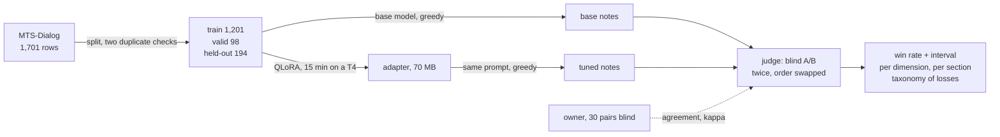
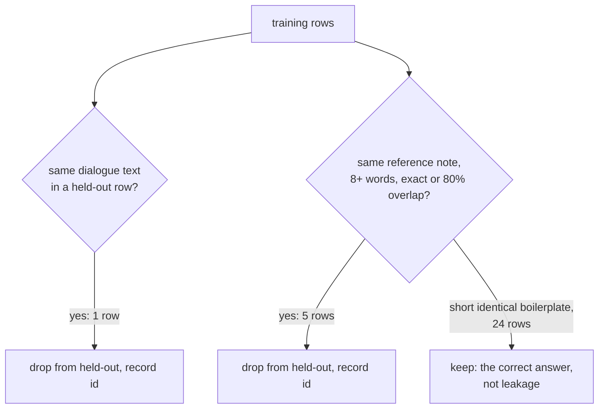
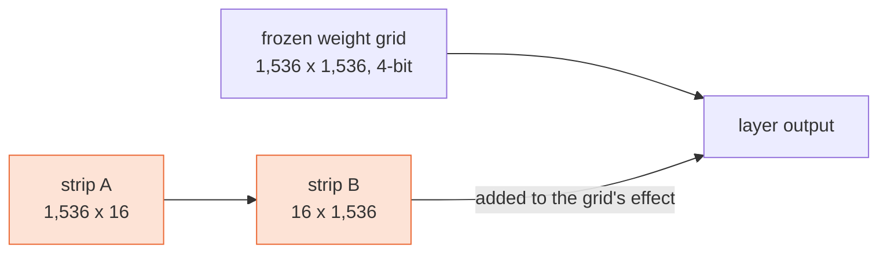
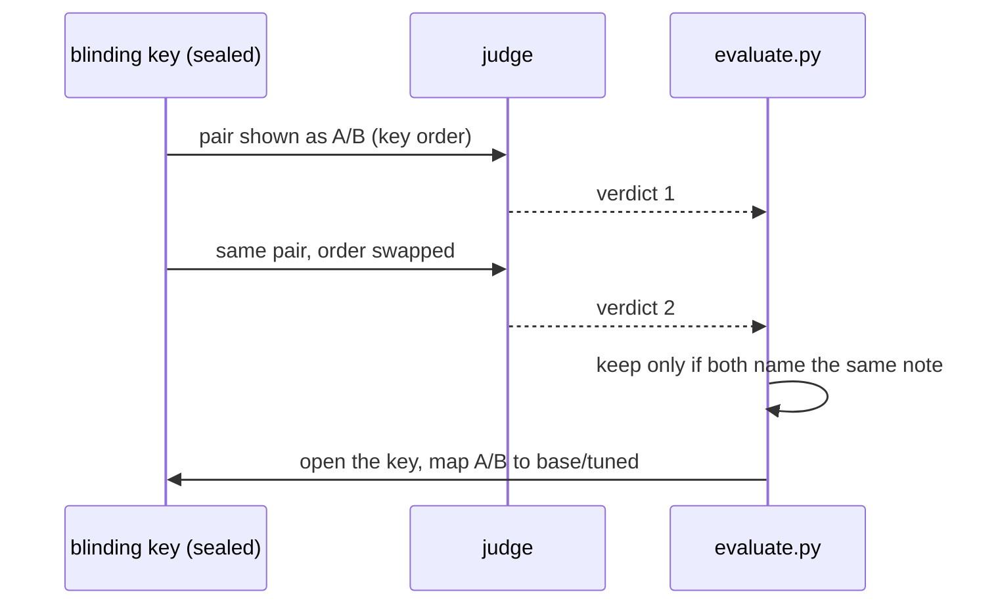

# The walkthrough: every step, in full

The Medium write-up is the summary. This is the long version: what each step does, why it
is there, what it produced, and where it lives in the code. It was written while the
project was built, one section per step of `PROCESS.md`, so that the person whose name is
on the repo could explain every step without notes. It is published for the same reason:
so that a reader can.

Each section has the same shape: a three-sentence summary, the terms it uses, a diagram
where the mechanism has parts, the mechanism in plain words with the real numbers, a
practitioner's card (when to use it, how, how it goes wrong), the common confusion, a
command to try, where it lives in the code, questions to check yourself against with the
answers folded, the numbers to remember, and references. A glossary closes the document.

Numbers are from the committed results (`results/metrics.md`, `results/train_config.json`,
`eval/holdout_ids.json`) and can be regenerated with the commands in the README.

---

## 0. The whole project on one page
---

🟢 built, writes the whole pipeline; every file below exists.

*Pipeline:* data → control → train → tuned → judge → score → taxonomy → write-up

> **In one breath.** A small model was fine-tuned to write clinical note sections from doctor-patient conversations, then judged blind against its own untouched base model. The base model won, 51.5% to 33.9%, because fine-tuning taught the model to state facts the patient never said. The evaluation, not the model, is the deliverable.



| Stage | What it produced | Where |
|---|---|---|
| Data | 194 sealed exam dialogues, ids frozen | `eval/holdout_ids.json` |
| Control | 199 base-model notes | `results/generations_base.jsonl` |
| Train | adapter (on Drive), config, loss log | `results/train_config.json`, `results/train_log.jsonl` |
| Candidate | 199 tuned notes | `results/generations_tuned.jsonl` |
| Judge | 388 verdicts, 171 kept | `results/judge_verdicts.jsonl` |
| Human pass | 30 pairs scored blind | `results/human_pack.md` |
| Metrics | the README tables | `results/metrics.md` |
| Taxonomy | 88 losses labelled | `results/losses.md` |

> [!WARNING]
> **Numbers to remember.**
> **194** held-out pairs, **171** kept after the swap check.
> Tuned preferred **33.9%** (95% CI 26.9 to 40.9), base **51.5%**, tie **14.6%**.
> Faithfulness **4.42 to 4.05**. ROUGE-L **0.18 to 0.28**.
> Losses: **41** invented facts, **35** omissions, of 88.

---

## 1. Data, the sealed exam, and leakage
---

🟢 built, writes `eval/holdout_ids.json`.

*Pipeline:* **data** → control → train → tuned → judge → score → taxonomy → write-up

> **In one breath.** The model learns from 1,201 examples, its loss is watched on 98 more, and 194 are sealed away as the exam. Two kinds of leakage were checked, a copied dialogue and the same source note behind a different dialogue. The second was found after training and removed, with the ids recorded.

| Term | Plain gloss | Value here |
|---|---|---|
| **Training set** | The examples the adapter learns from | 1,201 rows (1,200 after one over-length row) |
| **Validation set** | Examples whose loss is measured during training, never learned from | 98 rows |
| **Held-out set** | The sealed exam, never seen until after training | 194 rows |
| **Reference note** | The section text a clinician originally wrote, the training target | `section_text` in the CSV |
| **Leakage** | The model meeting exam material during training | 1 dialogue copy, 5 shared notes, removed |



> [!NOTE]
> **🧑‍🎓 The mechanism.** MTS-Dialog (Ben Abacha et al. 2023) is 1,701 short doctor-patient conversations, each with a **section name** (20 types such as History of Present Illness or Allergies) and the **reference note**, the section text a clinician originally wrote. The notes came first, from the public MTSamples collection, and the conversations were written afterwards to match them.
>
> The dataset ships an official split. We used it and froze the 200 test ids before training. Two leakage checks then ran on text, not ids. The first compares normalised dialogue text across splits and found one copy. The second compares reference notes, because the same source note can sit behind two different conversations, and found four exact matches and one near match. Twenty-four short identical notes such as "No known drug allergies" were kept, because identical boilerplate is the right answer, not a leak.
>
> The source is pinned: `data.py` downloads three CSVs from one commit and checks each file's SHA-256. A changed upstream file fails loudly rather than silently changing the exam.
>
> The trade-off: the note-level check was added after training, when the first tuned output read stated a date that was in the reference and nowhere in the conversation. The removal happened before any verdict existed and is recorded in `DECISIONS.md`. A cleaner project would have run both checks first.

> [!IMPORTANT]
> **🧑‍💻 In practice.** Contamination is the commonest silent error in fine-tuning write-ups. Check inputs and targets separately: an input check catches copied prompts, a target check catches shared source documents behind different prompts. Normalise text (case, whitespace) before comparing, use exact match plus a token-overlap threshold (Jaccard 0.8 here) for near-duplicates, and exempt short boilerplate by length. Record every dropped id in the frozen file so a reader can open each one. Pin the dataset to a commit and checksum the files.
>
> How it goes wrong: checking ids when ids restart per file (they do here, so ids carry the split name); checking only inputs; deleting contaminated rows from the training side after training (you cannot untrain, so the exclusion goes on the evaluation side and is stated).

> [!CAUTION]
> **Common confusion.** Validation and held-out are not the same thing. The model *sees* the validation set during training, but only to compute a loss number, never to update weights. The held-out set is never seen at all until the comparison. Contamination between training and held-out is train/test leakage, not target leakage (which is a feature encoding the label).

**Try it.**

```bash
python -m lora_eval_lab.data --download --stats   # train 1201, valid 98 (after dedup), held-out 194 (after dedup)
```

**In this repo.** `src/lora_eval_lab/data.py`: `cross_split_duplicates`, `cross_split_note_duplicates`, `build_holdout`, `download` (checksums), `format_example`. Frozen ids and dropped ids: `eval/holdout_ids.json`. Tests: `tests/test_data.py`.

**Check yourself.**

<details><summary><i>How many examples in each split, how the split was made, what the duplicate check found, and why leakage between splits matters?</i></summary>

Train 1,201, validation 98, held-out 194, from the dataset's official split. One held-out dialogue was word-for-word in train and five held-out reference notes came from encounters also in train; all six are out. A model that has met the exam material is recalling, not being tested.

</details>

<details><summary><i>Why pin the source to a commit with checksums rather than download the latest?</i></summary>

So the numbers are reproducible: a changed upstream file fails the checksum instead of silently changing the exam.

</details>

<details><summary><i>What are the three parts of one training example, and why is the section name in there?</i></summary>

System instruction, user turn with the section name and the conversation, assistant turn with the reference note. The same conversation can yield different sections, so the model has to be told which one to write.

</details>

> [!WARNING]
> **Numbers to remember.**
> **1,201 / 98 / 194** train, validation, held-out.
> **1 + 5** held-out rows removed, **24** boilerplate matches kept.
> Longest dialogue **1,509** words, which set the 2,048-token sequence limit.

### References

- *External:* Ben Abacha, Yim, Fan, Lin 2023, An Empirical Study of Clinical Note Generation from Doctor-Patient Encounters, EACL, [aclanthology.org/2023.eacl-main.168](https://aclanthology.org/2023.eacl-main.168/).
- *External:* Dataset: [github.com/abachaa/MTS-Dialog](https://github.com/abachaa/MTS-Dialog).

---

## 2. The control, and decoding
---

🟢 built, writes `results/generations_base.jsonl`.

*Pipeline:* data → **control** → train → tuned → judge → score → taxonomy → write-up

> **In one breath.** Before any training, the untouched base model wrote a note for every held-out conversation with the exact prompt the tuned model would later get. Both runs use greedy decoding, so outputs are repeatable, and every row carries a fingerprint of its prompt so the two runs can be proven identical.

| Term | Plain gloss | Value here |
|---|---|---|
| **Control** | The base model's outputs, produced before training, to compare against | 199 rows, `generations_base.jsonl` |
| **Greedy decoding** | Always take the most likely next token | `do_sample=False` |
| **Prompt fingerprint** | A hash of the exact messages sent, stored per row | `prompt_sha256`, 16 hex chars |
| **Length cap** | Hard stop on output length | `max_new_tokens=320` |

> [!NOTE]
> **🧑‍🎓 The mechanism.** A language model produces, at each step, a probability for every token in its vocabulary, and a **decoding** rule picks one. **Greedy** takes the most probable token every time, so the same prompt yields the same output on every run. **Sampling** draws at random in proportion to the probabilities and yields a different output each run.
>
> With 194 pairs and one output each, sampling would add a random draw per pair, noise on top of a small sample. Greedy removes it and makes the committed outputs checkable. The cost is style: greedy can be blunt or repetitive, and it is not how a product serves a model. Both models pay it equally.
>
> The control is produced first so that nobody can adjust the prompt after seeing the tuned outputs. The fingerprint enforces the other half: if the template differs between the base and tuned files for the same id, `judge.build_pairs` refuses to pair them.

> [!IMPORTANT]
> **🧑‍💻 In practice.** Fix the decoding for a comparison: greedy or a fixed seed, identical `max_new_tokens`, identical template, recorded in every output row rather than in a README. Hash the rendered messages and store the hash with the output; compare hashes when pairing. Generate the control before training and commit it. Set the length cap from the reference length distribution (the 95th percentile of reference notes here is 150 words, so 320 tokens covers all but runaway outputs, which is a failure you want to see).
>
> How it goes wrong: sampling at temperature 0.7 on a 200-pair comparison, then reporting a win rate that moves several points between reruns; a "small prompt fix" applied to one side only; outputs regenerated after the judge has run.

> [!CAUTION]
> **Common confusion.** Outputs being identical across reruns is a consequence of greedy decoding being deterministic. Greedy being repetitive or blunt is a separate cost. Sampling does not make a model less accurate; it makes the measurement noisier.

**Try it.**

```bash
python -m lora_eval_lab.generate --tag base --limit 2 --out /tmp/smoke.jsonl   # two rows, greedy; fp32 on CPU, slow
```

**In this repo.** `src/lora_eval_lab/generate.py`: `build_messages`, `prompt_hash`, `DECODING`, `run`. The pairing check: `judge.build_pairs`.

**Check yourself.**

<details><summary><i>Why does the base model generate over the held-out set before any training, and what would go wrong if we did it afterwards with a "slightly improved" prompt?</i></summary>

It is the control; a prompt changed after seeing tuned outputs makes the comparison unfair in a direction nobody can see.

</details>

<details><summary><i>What does greedy decoding mean, and why use it for both models rather than sampling?</i></summary>

Always take the most likely next token; deterministic, so no sampling noise on a small set and the committed outputs can be checked.

</details>

<details><summary><i>Each output row stores a fingerprint of the prompt. What problem does that catch?</i></summary>

The prompt template changing between the base run and the tuned run.

</details>

> [!WARNING]
> **Numbers to remember.**
> **199** base outputs, words p50/p90/max **21 / 71 / 125**.
> **199** tuned outputs, words p50/p90/max **12 / 128 / 277**.
> **0** prompt fingerprint mismatches between the two files.

### References

- *External:* Hugging Face, Generation strategies, [huggingface.co/docs/transformers/generation_strategies](https://huggingface.co/docs/transformers/generation_strategies).
- *External:* Holtzman et al. 2019, The Curious Case of Neural Text Degeneration, [arxiv.org/abs/1904.09751](https://arxiv.org/abs/1904.09751).

---

## 3. LoRA, QLoRA, and what a loss curve can say
---

🟢 built, writes `results/train_config.json`, `results/train_log.jsonl`.

*Pipeline:* data → control → **train** → tuned → judge → score → taxonomy → write-up

> **In one breath.** The 1.5 billion base weights are frozen; small low-rank matrices bolted onto 196 of the model's weight grids are the only thing that learns, and they save as a 70 MB adapter. The base is stored in 4-bit to fit a free GPU. Validation loss fell from 1.62 to 1.38 and flattened, which says the model learned this dataset's notes, not that the notes got better.

| Term | Plain gloss | Value here |
|---|---|---|
| **Rank** | How many directions of change the adapter can express | 16 |
| **Alpha** | A scale on the adapter's effect; alpha equal to rank is scale 1 | 16 |
| **Adapter** | The saved low-rank matrices, attached to the base at load time | 18.5 M parameters, 1.18%, about 70 MB |
| **4-bit (the Q)** | The frozen base stored with 4-bit numbers, a quarter of the memory | under 1 GB on the GPU |
| **Assistant-only loss** | Only the note tokens are compared; the prompt is read, not learned | `train_on_responses_only` |
| **Epoch** | One pass over the training set | 2, 300 steps in total |



> [!NOTE]
> **🧑‍🎓 The mechanism.** Take one of the model's weight grids, say 1,536 by 1,536 (2.4 million numbers). Full fine-tuning nudges all of them. LoRA freezes the grid and adds the product of two thin strips, 1,536 by 16 and 16 by 1,536: 49,000 trainable numbers, about 2%. The 16 is the **rank**, how many directions of change the strips can express. Strips go on seven grids per layer across 28 layers: 196 pairs, 18.5 million numbers, 1.18% of the model. Only those learn. Saved to disk they are the **adapter**, about 70 MB.
>
> **QLoRA** stores the frozen base in 4 bits instead of 16, shrinking it from about 3 GB to under 1 GB in GPU memory. The rounding is lossy but small, and the strips stay in full precision. On a free T4 with 15 GB, that is the difference between running and not running.
>
> Loss is cross-entropy per token: how well the model predicts the reference note's next token given the prompt. The **validation loss** is that number on 98 examples the adapter never learns from, measured every 25 steps. It fell from 1.62 to 1.38 and flattened over the last 75 steps without rising, so no overfitting at two epochs.
>
> What loss cannot see: whether the note is true to the conversation. It measures fit to the reference notes, and the reference notes contain facts the conversations lack. That is why the loss curve looked perfect and the blind comparison did not.

> [!IMPORTANT]
> **🧑‍💻 In practice.** Update rule: W = W₀ + (α / r) · B A, with B initialised to zero so step 0 equals the base. Defaults used here, from the Unsloth Qwen2.5 notebook: r 16, α 16, dropout 0, all seven attention and MLP projections, learning rate 2e-4, linear warmup over 5% of steps then linear decay, 2 epochs, effective batch 8, max length 2,048, fp16 (the T4 has no bf16), seed 3407, loss on assistant tokens only, best-validation checkpoint kept. Training took 15 min 20 s on a T4.
>
> Read the curve for three things: validation flattening (stop point), validation rising while training falls (memorising: keep the earlier checkpoint, fewer epochs next time), and the train-validation gap (0.1 nats here, small). One gradient spike at the epoch boundary is normal and recovered in a step.
>
> Vocabulary: pretraining is training from scratch; fine-tuning is any further training on a task; full fine-tuning updates all weights; LoRA is a parameter-efficient way of fine-tuning. "LoRA fine-tuned" is an honest instance of "fine-tuned".

> [!CAUTION]
> **Common confusion.** The adapter is not an extra layer. It is a pair of thin matrices added in parallel to an existing weight matrix, and there are 196 such pairs. And the 2.4 million vs 49,000 figures are for one matrix; the whole adapter is 18.5 million.

**Try it.**

```bash
python -c "import json; c=json.load(open('results/train_config.json')); print(c['steps'], c['seconds'], c['best_eval_loss'])"   # 300 923 1.3766
```

**In this repo.** `src/lora_eval_lab/train.py`: `CONFIG`, `to_text`, `train`. `results/train_config.json`, `results/train_log.jsonl`. Hyperparameter reasoning: `DECISIONS.md`, "Training hyperparameters".

**Check yourself.**

<details><summary><i>What LoRA changes and what it leaves alone, why 4-bit, what the adapter file is, and roughly how long training took?</i></summary>

Only the low-rank strips change; the base is frozen. 4-bit fits the 15 GB T4. The adapter is the saved strips, about 70 MB. Training took 15 minutes 20 seconds for 300 steps.

</details>

<details><summary><i>Loss is computed on the assistant turn only. What would the model be spending effort on otherwise?</i></summary>

Learning to predict the conversation it was given, which dilutes the note-writing signal.

</details>

<details><summary><i>Validation loss stops falling while training loss keeps falling: what is happening, and what do we do?</i></summary>

The model is memorising the training set. Keep the best-validation checkpoint, note it, and use fewer epochs next time.

</details>

> [!WARNING]
> **Numbers to remember.**
> **18,464,768** trainable parameters, **1.18%** of the model.
> Validation loss **1.62 to 1.38**; training loss **1.81 to 1.27**.
> **300** steps, **15 min 20 s**, one over-length row dropped (1,200 trained on).

### References

- *External:* Hu et al. 2021, LoRA: Low-Rank Adaptation of Large Language Models, [arxiv.org/abs/2106.09685](https://arxiv.org/abs/2106.09685).
- *External:* Dettmers et al. 2023, QLoRA: Efficient Finetuning of Quantized LLMs, [arxiv.org/abs/2305.14314](https://arxiv.org/abs/2305.14314).
- *External:* Hugging Face PEFT docs, [huggingface.co/docs/peft](https://huggingface.co/docs/peft).
- *External:* Unsloth docs, [unsloth.ai/docs](https://unsloth.ai/docs).

---

## 4. Blind judging: the key, the swap, the human anchor
---

🟢 built, writes `results/blinding_key.json`, `results/judge_verdicts.jsonl`, `results/human_pack.md`.

*Pipeline:* data → control → train → tuned → **judge** → score → taxonomy → write-up

> **In one breath.** A judge sees each pair as A and B with the mapping to base and tuned sealed in a separate file. Every pair is judged twice with the order swapped and kept only if the judge picks the same note both times. The owner scored 30 pairs blind before the judge ran, so the judge's agreement with a human can be reported.

| Term | Plain gloss | Value here |
|---|---|---|
| **Judge** | A language model given the rubric and the pair | `gemini-3.6-flash`, temperature 0 |
| **Blinding key** | Which side is tuned, decided by a seeded draw, stored apart from verdicts | `results/blinding_key.json`, 94 of 194 tuned as A |
| **Position swap** | Judge each pair twice, orders reversed, keep only agreeing verdicts | 23 of 194 dropped, all favoured the left slot |
| **Human anchor** | A person scores a subset blind before the judge runs | 30 pairs: base 22, tuned 7, tie 1 |
| **Kappa** | Agreement beyond chance between two raters | 0.41, raw agreement 0.69, on 29 pairs |
| **Reference in the prompt** | Shown to calibrate format and detail, not as the source of facts | "calibration only" in `eval/judge_prompt.md` |



> [!NOTE]
> **🧑‍🎓 The mechanism.** The judge reads the section name, the conversation, the reference note (labelled calibration only), and two candidates labelled A and B. It scores each on faithfulness, completeness, format and concision, 1 to 5, and states a preference or a tie. The **rubric** says faithfulness outranks everything: a shorter note with no invented facts beats a fuller note with one.
>
> **Blinding.** A seeded draw decides per pair whether the tuned note is A or B. The mapping is the key, written once and read only by the scoring code after all verdicts exist. Neither the judge nor the owner sees it.
>
> **Position swap.** Language-model judges show **position bias**, a preference for one slot. So every pair is judged twice, key order and reversed, and kept only if both verdicts name the same note (or both say tie). Here 23 of 194 pairs were inconsistent, and every one involved the judge preferring the left-hand slot. That count is the measurement of the bias. A sensitivity line recomputes the rates with dropped pairs as ties.
>
> **Human anchor.** Thirty pairs scored by the owner with the same rubric, before the judge ran, so the scores are independent. Agreement with the judge on the 29 kept: 0.69 raw, **kappa** 0.41. Kappa subtracts the agreement two raters would reach by their label habits alone, so it says how much they agree beyond chance. It is symmetric: it does not say who is right.
>
> The trade-off: the kept-only win rate is computed on fewer pairs, and the judge remains one model with its own tastes. Fluency bias survives blinding and swapping.

> [!IMPORTANT]
> **🧑‍💻 In practice.** Estimand: P(tuned preferred over base). Blind with a seeded Bernoulli(0.5) per item stored apart from verdicts. Query the judge under both orderings; keep item i only if both map to the same element of {tuned, base, tie}; report the drop count and its direction; run a sensitivity with dropped items as ties (Zheng et al. 2023 use swap-and-agree; Wang et al. 2023 quantify the effect). Calibrate with a human subset scored before the judge, and report raw agreement and Cohen's kappa with n.
>
> Show the reference for format calibration but instruct the judge to score faithfulness against the input only, then spot-check items where the reference contains facts absent from the input. Here two such items scored faithfulness 5: the judge missed them. Judge with temperature 0 and a JSON schema, keep the raw reply on every row, and write each verdict as it lands so the run resumes.
>
> How it goes wrong: single-pass judging (bias folded into the win rate); the judge asked to explain its own marks (a second unchecked opinion); the human pass done after seeing the judge's verdicts (no longer independent); "we agreed 80%" without kappa when the outcomes are lopsided.

> [!CAUTION]
> **Common confusion.** It is the *pair* that gets dropped, not a position. And kappa does not say whose verdicts are more reliable; it says how much two raters agree beyond chance. The human's 30 anchor the judge's 171; neither replaces the other.

**Try it.**

```bash
python -m lora_eval_lab.judge --human   # refuses: the filled pack exists; pass --force only to destroy it
```

**In this repo.** `src/lora_eval_lab/judge.py`: `make_key`, `shown`, `to_model`, `run_judge`, `human_pack`, `parse_human_pack`. `eval/rubric.md`, `eval/judge_prompt.md`. `src/lora_eval_lab/evaluate.py`: `consensus`, `agreement`.

**Check yourself.**

<details><summary><i>Why blinding, why the swap, why a human subset, and what agreement rate you saw?</i></summary>

So the labels cannot leak into verdicts; to measure position bias rather than assume it away; to anchor the judge to a human reading; raw agreement 0.69, kappa 0.41 on 29 pairs.

</details>

<details><summary><i>All 23 dropped judge pairs involved preferring A. What does that tell you about the judge, and what would you say to someone who ran single-pass judging?</i></summary>

Its bias is one-directional and real. Single-pass judging would have baked that into the win rate with no way to see it.

</details>

<details><summary><i>Kappa was 0.41. Would you trust the judge's 171 verdicts more or less than your own 30?</i></summary>

Kappa measures agreement, not reliability. Lean on the 171 for the estimate, say that judge and human disagree on about three pairs in ten, and keep the 30 as the anchor.

</details>

> [!WARNING]
> **Numbers to remember.**
> **388** verdicts, **0** parse failures, **23** dropped, **all 23** favoured the left slot.
> Human pass: base **22**, tuned **7**, tie **1**.
> Raw agreement **0.69**, kappa **0.41**.

### References

- *External:* Zheng et al. 2023, Judging LLM-as-a-Judge with MT-Bench and Chatbot Arena, [arxiv.org/abs/2306.05685](https://arxiv.org/abs/2306.05685).
- *External:* Wang et al. 2023, Large Language Models are not Fair Evaluators, [arxiv.org/abs/2305.17926](https://arxiv.org/abs/2305.17926).
- *External:* Cohen 1960, A Coefficient of Agreement for Nominal Scales.

---

## 5. The numbers: win rate, interval, dimensions, sections
---

🟢 built, writes `results/metrics.md`.

*Pipeline:* data → control → train → tuned → judge → **score** → taxonomy → write-up

> **In one breath.** Over 171 kept pairs the tuned model was preferred 33.9% of the time, the base 51.5%, tie 14.6%. The 95% interval on the tuned rate is 26.9 to 40.9, which excludes 50%, so it is a loss, not parity. Faithfulness is the dimension that fell.

| Term | Plain gloss | Value here |
|---|---|---|
| **Win rate** | Share of kept pairs where the tuned note was preferred | 0.339 |
| **Bootstrap interval** | The range the win rate would plausibly land in on a different 171 pairs | 0.269 to 0.409 |
| **Parity** | The interval contains 50% | Not the case here |
| **Sensitivity line** | Rates recomputed with dropped pairs as ties | tuned 0.299, base 0.454, tie 0.247 |
| **Paired difference** | Tuned minus base on a dimension, per pair, averaged | faithfulness -0.37, CI -0.63 to -0.11 |

| Dimension (1 to 5) | Base | Tuned | Difference | 95% interval |
|---|---|---|---|---|
| Faithfulness | 4.42 | 4.05 | **-0.37** | -0.63 to -0.11 |
| Completeness | 4.25 | 4.01 | -0.23 | -0.45 to 0.00 |
| Format | 4.51 | 4.42 | -0.09 | -0.29 to +0.11 |
| Concision | 4.45 | 4.37 | -0.08 | -0.27 to +0.11 |

| Section | Kept pairs | Tuned | Base | Tie |
|---|---|---|---|---|
| History of Present Illness | 44 | 0.41 | 0.55 | 0.05 |
| Family and Social History | 38 | 0.37 | 0.53 | 0.11 |
| Review of Systems | 16 | 0.19 | 0.75 | 0.06 |
| Past Medical History | 13 | 0.69 | 0.15 | 0.15 |
| Assessment | 11 | 0.45 | 0.55 | 0.00 |
| Allergies | 10 | 0.10 | 0.30 | 0.60 |

Sections with fewer than ten kept pairs are in `results/metrics.md` and not interpreted.

> [!NOTE]
> **🧑‍🎓 The mechanism.** The win rate is a proportion on a small sample, so it needs an interval. The **bootstrap** resamples the 171 verdicts with replacement 10,000 times, computes the win rate each time, and takes the 2.5th and 97.5th percentiles. It is seeded, so it reproduces. Width shrinks with the square root of the pair count; nothing else narrows it. **Parity** is when the interval contains 50%. Ours runs 26.9 to 40.9, entirely below 50%, so the write-up says "not parity: fine-tuning made the notes worse as judged blind."
>
> Per dimension, each pair gives a tuned score and a base score (averaged over the two orderings), and the paired difference gets its own bootstrap interval. Faithfulness fell by 0.37 with an interval that excludes zero. Format and concision did not move, because the base model already writes an acceptable section zero-shot.
>
> Per section, History of Present Illness (the ambient-scribe case) went 0.41 tuned to 0.55 base on 44 pairs, interval 0.27 to 0.55 on the tuned share. Past Medical History is the one section the tuned model won. Allergies and Past Surgical History were mostly ties, as they should be when both models write "No known drug allergies".

> [!IMPORTANT]
> **🧑‍💻 In practice.** Report the win rate over kept pairs with a percentile bootstrap (B = 10,000, seeded), the tie and dropped counts beside it, and a sensitivity line with dropped pairs as ties. The standard error at p = 0.5 is about √(0.25 / n): 0.035 at n = 199, 0.069 at n = 53. Bootstrap each rubric dimension's paired difference too. Break the headline out by section when the sections differ in difficulty; a good overall rate can be mostly one-line sections. State when a subset is too small to interpret.
>
> Assumptions: pairs are exchangeable; the bootstrap treats them as i.i.d., which a mixed section distribution mildly violates (the per-section table is the mitigation).

> [!CAUTION]
> **Common confusion.** The interval is wide because of the number of *judged* pairs, not the number of training pairs. And "the interval excludes 50%" is the sentence that separates a loss from parity; the point estimate alone does not.

**Try it.**

```bash
python -m lora_eval_lab.evaluate   # prints the tables; kept 171, dropped 23
```

**In this repo.** `src/lora_eval_lab/evaluate.py`: `rates`, `bootstrap_ci`, `dimension_table`, `per_section`, `compute`, `render`. Output: `results/metrics.json`, `results/metrics.md`.

**Check yourself.**

<details><summary><i>A win rate of 0.56 with an interval of 0.48 to 0.64: what do you write in the README, and why is the interval that wide?</i></summary>

"Preferred in 56% (95% CI 48 to 64); the interval includes 50%, so no preference is shown." Wide because 199 judged pairs is few.

</details>

<details><summary><i>The win rate is 33.9% with an interval of 26.9 to 40.9. What does the README say, and why is it not parity?</i></summary>

"The interval excludes 50%, so this is not parity: fine-tuning made the notes worse as judged blind." Parity would need the interval to contain 50%.

</details>

> [!WARNING]
> **Numbers to remember.**
> Tuned **33.9%** (26.9 to 40.9), base **51.5%**, tie **14.6%**, over **171** pairs.
> Faithfulness **-0.37** (-0.63 to -0.11).
> History of Present Illness: **0.41** tuned on 44 pairs (0.27 to 0.55).

### References

- *External:* Efron and Tibshirani 1993, An Introduction to the Bootstrap, chapter 13.

---

## 6. ROUGE-L, and why it went the wrong way
---

🟢 built, writes `results/metrics.json` (`rouge_l`).

*Pipeline:* data → control → train → tuned → judge → **score** → taxonomy → write-up

> **In one breath.** ROUGE-L counts how much of the reference note a candidate reproduces, in order. It rose from 0.18 to 0.28 while blind preference fell, because the tuned model learned the references' register and their unsupported specifics. Overlap is not correctness.

| Term | Plain gloss | Value here |
|---|---|---|
| **Longest common subsequence** | The longest run of words in both texts in the same order, gaps allowed | computed on lower-cased whitespace tokens |
| **Recall** | Shared / words in the reference | |
| **Precision** | Shared / words in the candidate | |
| **F1** | The harmonic mean of the two | base 0.183, tuned 0.282 |

> [!NOTE]
> **🧑‍🎓 The mechanism.** Split both texts into words. Find the **longest common subsequence**. Then:

```
P  = shared / words in candidate
R  = shared / words in reference
F1 = 2 · P · R / (P + R)
```

> **shared** is the length of the longest common subsequence. Worked: "the cat sat" against "the cat ran" shares "the cat", so P = R = 2/3 and F1 = 0.67.
>
> Why up here means worse: the references contain ages, dates and doses the conversations never state. A tuned output that copies that shape shares more words in order with the reference, so ROUGE rises, while stating facts the patient never said, so faithfulness falls. The base model, in its own words, matched fewer words and invented less.

> [!IMPORTANT]
> **🧑‍💻 In practice.** Use ROUGE as a sanity check that outputs are in the neighbourhood of the target (not empty, not chat), and for drift between runs of an unchanged task. Never as a quality result on a task where facts matter, and never on a dataset whose references contain material the inputs lack. Record casing, stemming and stopword choices (none here). Report it beside a preference or faithfulness result with the sentence "rewards overlap, not correctness".
>
> How it goes wrong: ROUGE rises while blind preference falls (this project); paraphrase penalised; length games raising recall.

> [!CAUTION]
> **Common confusion.** ROUGE going up means the outputs became *more* like the reference, not different from it. Both facts hold at once here because the reference and the conversation disagree.

**Try it.**

```bash
pytest -q -k rouge   # 2 passed: the hand-worked 2/3 and 6/7
```

**In this repo.** `src/lora_eval_lab/evaluate.py`: `lcs_length`, `rouge_l`. Tests: `test_lcs_by_hand`, `test_rouge_l_by_hand` in `tests/test_evaluate.py`.

**Check yourself.**

<details><summary><i>ROUGE-L went up while preference went down. Explain to a colleague why both can be true at once, using this dataset.</i></summary>

ROUGE measures similarity to the reference; the references hold facts absent from the conversations; the tuned model matched the reference more and the conversation less. Preference is the blind judge's choice against the conversation.

</details>

> [!WARNING]
> **Numbers to remember.**
> ROUGE-L F1 base **0.183**, tuned **0.282**.
> "the cat sat" vs "the cat ran": F1 **2/3**.

### References

- *External:* Lin 2004, ROUGE: A Package for Automatic Evaluation of Summaries, [aclanthology.org/W04-1013](https://aclanthology.org/W04-1013/).
- *External:* Fabbri et al. 2021, SummEval, for ROUGE against human judgement.

---

## 7. The failure taxonomy, and what the data taught the model
---

🟢 built, writes `results/losses.md`.

*Pipeline:* data → control → train → tuned → judge → score → **taxonomy** → write-up

> **In one breath.** Every kept pair the tuned model lost was read and labelled with its dominant failure. Forty-one of 88 were invented facts, 35 were omissions. Two properties of the data explain the inventions: the references hold facts the conversations lack, and they follow a template with slots the model learned to fill.

| Failure | Count | Typical case |
|---|---|---|
| Hallucinated fact | 41 | An age or date the patient never said; "denies stroke" from a patient who reported one; stopped medications listed as current |
| Omitted fact | 35 | The terse learned style dropped the relative a condition belongs to, or why a drug was stopped |
| Format break | 6 | Repetition loops to the length cap; a one-word output |
| Other | 5 | Correct content, the judge preferred the base model's phrasing |
| Wrong section | 1 | Reason for visit written into Other History |

> [!NOTE]
> **🧑‍🎓 The mechanism.** The judge is the instrument under test, so asking it to explain its own marks would add a second unchecked opinion. The losses were labelled by the implementing agent (a different model from the judge) reading the conversation, both notes and the judge's two reasons, one label per pair, the dominant failure where several apply. The owner audited a seeded random 15 and agreed on all 15. That provenance is stated wherever the table appears.
>
> Why losses only: the question is "what got worse", and 88 is few enough to read every one.
>
> Two data reasons the model learned to invent. First, the notes were written before the conversations, so a reference can state an age or a date the conversation never mentions; training on that pair rewards writing specifics that are not in the input. Second, the references follow a fixed template with slots ("The patient is a NN-year-old [race] [sex] who presents with..."), and the model learned to fill every slot whether or not the conversation supplied it. Two held-out outputs state an exact age that appears in the reference and nowhere in the conversation; the judge scored both faithfulness 5.

> [!IMPORTANT]
> **🧑‍💻 In practice.** Define the categories before reading (here: hallucinated fact, omitted fact, wrong section, format break, other), label the dominant failure per item, state who labelled and audit a random subset with a second reader, and report the agreement. Read the losses, not the wins; wins do not answer "what got worse". Then trace the top category back to the data: here, unsupported specifics in the targets and a slot-filling template.
>
> What follows from it, in order: a one-shot prompted base to set the real bar; strip unsupported specifics from the references and retrain with the identical recipe; a preference stage that rewards "shorter and true" over "fuller and invented". Not retrieval: nothing is missing from the prompt, the failure is invented knowledge.

> [!CAUTION]
> **Common confusion.** "Fine-tuning lost" is not "fine-tuning is the wrong tool". This fine-tune, on these targets, taught invention because the targets invent. Fixing the targets is the experiment that separates the two claims.

**Try it.**

```bash
python -m lora_eval_lab.evaluate --taxonomy   # refuses: losses.md holds labels; pass --force only to destroy them
```

**In this repo.** `results/losses.md` (every loss, the judge's reasons, the label, the provenance note). `src/lora_eval_lab/evaluate.py`: `losses_pack`, `parse_labels`. `DECISIONS.md` entries of 2026-08-28 and 2026-08-30.

**Check yourself.**

<details><summary><i>Why is the failure taxonomy hand-labelled rather than asked of the judge, and why over losses specifically?</i></summary>

The judge cannot audit itself; losses are the "what got worse" question and are few enough to read in full.

</details>

<details><summary><i>The tuned model lost on faithfulness. Give two reasons from the data (not from the model) why fine-tuning on MTS-Dialog could teach a model to invent.</i></summary>

References contain facts absent from the conversations (notes first, dialogues written after); references follow a slot-filling template.

</details>

> [!WARNING]
> **Numbers to remember.**
> **41** invented, **35** omitted, **6** format, **5** style, **1** wrong section, of **88**.
> Audit: **15 of 15** agreed.

### References

- *External:* Fabbri et al. 2021, SummEval (why overlap metrics mislead).
- *External:* This repo's `DECISIONS.md`.

---

## 8. Hand-rolled metrics
---

🟢 built, writes `tests/test_evaluate.py`.

*Pipeline:* data → control → train → tuned → judge → **score** → taxonomy → write-up

> **In one breath.** Win rate, bootstrap interval, ROUGE-L and kappa are written from their definitions in `evaluate.py`, each pinned by a test whose expected value was worked by hand. When the number is the deliverable, every step of it has to be checkable in one file.

| Hand-rolled (a formula) | Imported (a trained model) |
|---|---|
| Win rate, tie rate, dropped count | Qwen2.5-1.5B and its tokenizer |
| Percentile bootstrap, 10,000 resamples, seeded | The Gemini judge |
| ROUGE-L via longest common subsequence | Unsloth's training kernels |
| Cohen's kappa over three labels | |

> [!NOTE]
> **🧑‍🎓 The mechanism.** An evaluation score is a function: verdicts in, number out. Import it and you inherit options you did not choose (library ROUGE has stemming and tokenisation settings that change the number). Write it, ten to forty lines, and test it against a value you computed on paper, and the test is the proof that the code matches the maths. The rule that stops this becoming silly: hand-roll what is a formula, import what is a trained model.

> [!IMPORTANT]
> **🧑‍💻 In practice.** Kappa: κ = (p_o − p_e) / (1 − p_e), with p_e from each rater's marginal label frequencies. Worked check in the tests: ten items, human 6/3/1 and judge 5/4/1 across tuned/base/tie, p_o = 0.90, p_e = (30 + 12 + 1) / 100 = 0.43, κ = 0.47 / 0.57 = 0.82. Two raters who both say "tuned" every time have p_o = p_e = 1 and κ = 0. Bootstrap: degenerate inputs (all wins) must give [1, 1]; a 60/40 split on 100 items must land near 0.60 ± 0.10 by the normal approximation. ROUGE-L: "a b c" vs "a b c d" is 6/7.

> [!CAUTION]
> **Common confusion.** Hand-rolling the metric does not validate the judge. It validates the arithmetic. Judge quality is what the human pass is for.

**Try it.**

```bash
pytest -q -k "kappa or bootstrap"   # 4 passed, expected values worked by hand
```

**In this repo.** `tests/test_evaluate.py`: `test_kappa_by_hand`, `test_rouge_l_by_hand`, `test_bootstrap_ci_degenerate_and_containment`. `DECISIONS.md` and the rag-eval-lab entry "Hand-roll BM25 and the metrics, import the encoder".

**Check yourself.**

<details><summary><i>What does Cohen's kappa add over "we agreed 80% of the time"?</i></summary>

It subtracts the agreement expected from each rater's label habits; two raters who always say "tuned" agree 100% with kappa 0.

</details>

> [!WARNING]
> **Numbers to remember.**
> Kappa worked example **0.82**; ROUGE-L worked example **2/3** and **6/7**.
> **40** tests, all with hand-computed expected values.

### References

- *External:* Cohen 1960.
- *External:* Lin 2004. Efron and Tibshirani 1993.

---

## What this walkthrough is not

A weekend portfolio project, built with Claude Code as the implementing agent and reviewed line by line. One judge, one human who is not a clinician, no hyperparameter search, constructed dialogues. The result stands for this fine-tune on this data; part two (the same sealed exam, a one-shot prompted base, cleaned targets) is the experiment that would separate "the method failed" from "the data taught the wrong thing".

---

## Glossary
---

Every bold term from the key-terms tables, alphabetical.

- **4-bit (the Q).** The frozen base stored with 4-bit numbers, a quarter of the memory
- **Adapter.** The saved low-rank matrices, attached to the base at load time
- **Alpha.** A scale on the adapter's effect; alpha equal to rank is scale 1
- **Assistant-only loss.** Only the note tokens are compared; the prompt is read, not learned
- **Blinding key.** Which side is tuned, decided by a seeded draw, stored apart from verdicts
- **Bootstrap interval.** The range the win rate would plausibly land in on a different 171 pairs
- **Control.** The base model's outputs, produced before training, to compare against
- **Epoch.** One pass over the training set
- **F1.** The harmonic mean of the two
- **Greedy decoding.** Always take the most likely next token
- **Held-out set.** The sealed exam, never seen until after training
- **Human anchor.** A person scores a subset blind before the judge runs
- **Judge.** A language model given the rubric and the pair
- **Kappa.** Agreement beyond chance between two raters
- **Leakage.** The model meeting exam material during training
- **Length cap.** Hard stop on output length
- **Longest common subsequence.** The longest run of words in both texts in the same order, gaps allowed
- **Paired difference.** Tuned minus base on a dimension, per pair, averaged
- **Parity.** The interval contains 50%
- **Position swap.** Judge each pair twice, orders reversed, keep only agreeing verdicts
- **Precision.** Shared / words in the candidate
- **Prompt fingerprint.** A hash of the exact messages sent, stored per row
- **Rank.** How many directions of change the adapter can express
- **Recall.** Shared / words in the reference
- **Reference in the prompt.** Shown to calibrate format and detail, not as the source of facts
- **Reference note.** The section text a clinician originally wrote, the training target
- **Sensitivity line.** Rates recomputed with dropped pairs as ties
- **Training set.** The examples the adapter learns from
- **Validation set.** Examples whose loss is measured during training, never learned from
- **Win rate.** Share of kept pairs where the tuned note was preferred
