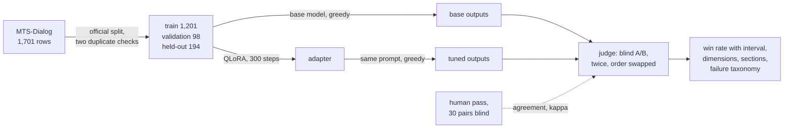
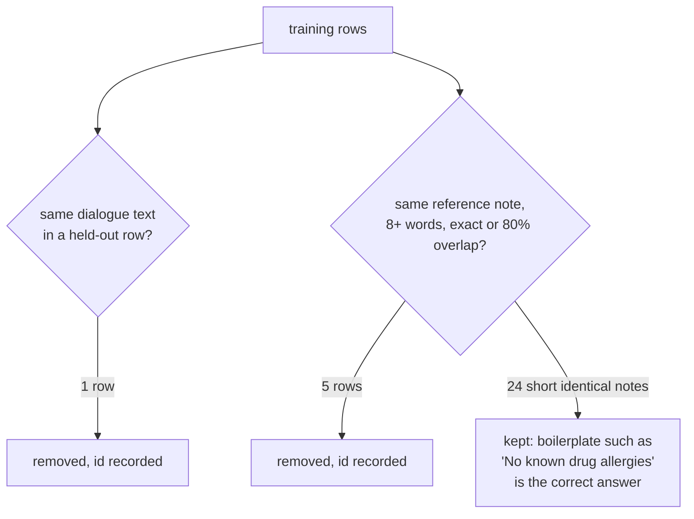
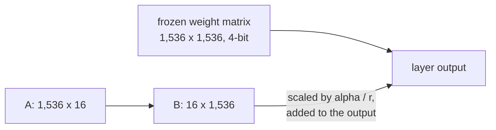
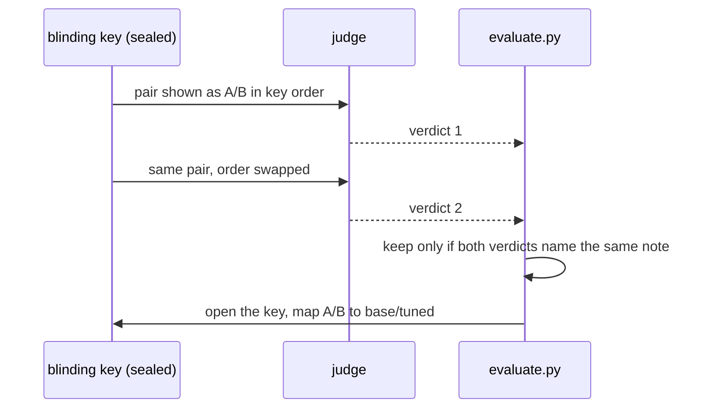

# Walkthrough

How a small open-weight model was fine-tuned on one clinical task and evaluated blind
against its own base model, step by step: what each step does, why it is there, what it
produced, and where it lives in the code. Numbers come from the committed results and can
be regenerated with the commands shown.

## Contents

1. [The question and the answer](#1-the-question-and-the-answer)
2. [Data and the held-out set](#2-data-and-the-held-out-set)
3. [The control: base-model outputs first](#3-the-control-base-model-outputs-first)
4. [Training: QLoRA on a free GPU](#4-training-qlora-on-a-free-gpu)
5. [Blind judging with a position swap](#5-blind-judging-with-a-position-swap)
6. [The human calibration pass](#6-the-human-calibration-pass)
7. [Metrics: win rate, interval, dimensions, sections](#7-metrics-win-rate-interval-dimensions-sections)
8. [ROUGE-L, and why it moved the wrong way](#8-rouge-l-and-why-it-moved-the-wrong-way)
9. [The failure taxonomy](#9-the-failure-taxonomy)
10. [What the result shows, and what it does not](#10-what-the-result-shows-and-what-it-does-not)
11. [Reproducing the numbers](#11-reproducing-the-numbers)
12. [References](#12-references)
13. [Glossary](#13-glossary)

---

## 1. The question and the answer

The task is the ambient-scribe problem in miniature: given a doctor-patient conversation
and the name of a clinical note section, write that section. The model is
Qwen2.5-1.5B-Instruct. The question is whether fine-tuning it on 1,201 examples makes its
notes better than the same model with a good prompt, judged blind by a rubric a clinician
would accept.

| | Base model | Fine-tuned model |
|---|---|---|
| Preferred, blind, 171 kept pairs | **51.5%** | **33.9%** (95% CI 26.9 to 40.9) |
| Faithfulness, 1 to 5 | 4.42 | 4.05 |
| ROUGE-L against the reference | 0.183 | 0.282 |
| Human pass, 30 pairs | 22 preferred | 7 preferred |

The interval on the fine-tuned share excludes 50%, so the result is a loss, not parity.
Faithfulness is the dimension that fell. ROUGE-L rose at the same time, which is the
clearest demonstration in the project of why overlap with a reference is not a quality
measure.



| Stage | Output | File |
|---|---|---|
| Data | 194 held-out dialogues, ids frozen | `eval/holdout_ids.json` |
| Control | 199 base-model notes | `results/generations_base.jsonl` |
| Training | adapter (on Drive), config, loss log | `results/train_config.json`, `results/train_log.jsonl` |
| Candidate | 199 tuned notes | `results/generations_tuned.jsonl` |
| Judging | 388 verdicts, 171 kept | `results/judge_verdicts.jsonl` |
| Human pass | 30 pairs scored | `results/human_pack.md` |
| Metrics | the tables below | `results/metrics.md` |
| Taxonomy | 88 losses labelled | `results/losses.md` |

---

## 2. Data and the held-out set

MTS-Dialog (Ben Abacha et al. 2023) has 1,701 rows. Each row is a short conversation, a
section name (20 types, dominated by family and social history at 351 training rows and
history of present illness at 282), and the reference note: the section text a clinician
originally wrote. The notes came first, as public de-identified excerpts; the conversations
were written afterwards to match them. That order matters later: a reference can state an
age, a date or a dose that its conversation never mentions.

| Set | Rows | Role |
|---|---|---|
| Training | 1,201 (1,200 after one over-length row) | The examples the adapter learns from |
| Validation | 98 | Loss is measured here during training; never learned from |
| Held-out | 194 | The sealed test set, never seen until the comparison |

The dataset's official split was used and the 200 test ids were frozen before training.
Two leakage checks then ran on text rather than ids, because ids restart at zero in every
split file.



The first check compares normalised dialogue text across splits and found one copy. The
second compares reference notes, because the same source note can sit behind two different
conversations, and found four exact matches and one near match (token overlap 0.83). Short
identical notes were kept: the same allergy sentence recurring across unrelated encounters
is the right answer, not a leak.

> [!WARNING]
> The note-level check was added after training, when the first tuned output read stated a date that appeared in the reference and nowhere in the conversation. The five rows were removed before any verdict existed, and the change is recorded in `DECISIONS.md`. A cleaner project would run both checks before training; an input-only check is the common omission.

The source is pinned. `data.py` downloads three CSVs from one commit of the source
repository and checks each file's SHA-256 against values in the code. A changed upstream
file fails loudly rather than silently changing the test set.

Each training example is a three-turn chat: a system instruction ("write the requested
section, use only what is in the conversation"), a user turn with the section name and the
conversation, and the reference note as the assistant's answer. At evaluation the third
turn is withheld and the model writes it. The section name is in the prompt because the
same conversation can legitimately yield different sections.

**Reproduce.**

```bash
python -m lora_eval_lab.data --download --stats   # train 1201, valid 98, held-out 194
```

**Code.** `src/lora_eval_lab/data.py`: `download`, `cross_split_duplicates`,
`cross_split_note_duplicates`, `build_holdout`, `format_example`. Tests in
`tests/test_data.py`, including a planted duplicate and a planted boilerplate note.

---

## 3. The control: base-model outputs first

Before any training, the untouched base model wrote a note for every held-out conversation
with the exact prompt the tuned model would later receive. The comparison needs a "before"
taken with the same settings as the "after", and producing it first removes the
temptation to adjust the prompt once the tuned outputs have been seen.

| Setting | Value | Reason |
|---|---|---|
| Decoding | Greedy (`do_sample=False`) | Same prompt gives the same output on every run; the committed outputs can be checked |
| Length cap | `max_new_tokens=320` | The 95th percentile of reference notes is 150 words; the cap catches runaway outputs without truncating real ones |
| Prompt fingerprint | SHA-256 of the rendered messages, per row | The pairing code refuses to compare base and tuned rows whose prompts differ |
| Precision | 4-bit NF4 on the GPU | Same loading as training |

Greedy decoding has a cost: it can be blunt or repetitive, and it is not how a product
serves a model. Both models pay it equally, and with 194 pairs and one output each, the
alternative (sampling) would add a random draw per pair on top of a small sample.

> [!NOTE]
> Identical outputs across reruns follow from greedy decoding being deterministic. Repetition is a separate cost of the same choice. Sampling would not make the model less accurate; it would make the measurement noisier.

**Reproduce.** The base run is a Colab cell (`notebooks/lora_eval_lab_colab.ipynb`); a
two-row CPU smoke test works locally:

```bash
python -m lora_eval_lab.generate --tag base --limit 2 --out /tmp/smoke.jsonl
```

**Code.** `src/lora_eval_lab/generate.py`: `build_messages`, `prompt_hash`, `DECODING`,
`run`. The fingerprint check: `judge.build_pairs`.

---

## 4. Training: QLoRA on a free GPU

Full fine-tuning updates all 1.5 billion weights and needs roughly 24 GB of GPU memory
with the Adam optimiser. A free Colab T4 has 15 GB. LoRA freezes the base and trains a
low-rank update alongside each target weight matrix; QLoRA additionally stores the frozen
base in 4-bit so it fits.



| Parameter | Value | Note |
|---|---|---|
| Rank r, alpha | 16, 16 | Unsloth defaults; alpha equal to rank gives scale 1 |
| Target matrices | q, k, v, o, gate, up, down projections, all 28 layers | 196 low-rank pairs |
| Trainable parameters | 18,464,768 of 1,562,179,072 | 1.18%; the adapter is about 70 MB |
| Learning rate | 2e-4, linear warmup over 16 steps, linear decay | |
| Epochs, steps | 2, 300 | Effective batch 8 |
| Sequence length | 2,048 tokens | One training row exceeded it and was dropped |
| Precision | fp16 | The T4 has no bf16 |
| Loss | Assistant tokens only | The prompt is read, not learned |
| Checkpoint kept | Lowest validation loss | The final step, here |
| Wall time | 15 min 20 s | |

| Step | Training loss | Validation loss |
|---|---|---|
| 25 | 1.811 | 1.615 |
| 150 (end of epoch 1) | 1.391 | 1.416 |
| 300 (end of epoch 2) | 1.266 | 1.377 |

Validation loss fell from 1.62 to 1.38 and flattened over the last 75 steps without
rising: no overfitting at two epochs, and no sign that a third would help. The train-
validation gap at the end is 0.1 nats.

> [!NOTE]
> Loss measures how well the model predicts the reference notes. It cannot see whether a note is true to the conversation. Because the reference notes contain facts the conversations lack, a model can improve this number by learning to state facts that are not in its input. That is what happened, and it is why the loss curve and the blind comparison disagree.

The training data is rendered to text with the model's own chat template, and the loss is
masked to the assistant turn with Unsloth's `train_on_responses_only`. Without the mask,
most of the gradient would train the model to predict the conversation it was given.

**Reproduce.** Training is a Colab cell; the pure parts (config, dataset shaping, log
export) are tested on CPU:

```bash
pytest -q tests/test_train.py   # 5 passed
```

**Code.** `src/lora_eval_lab/train.py`: `CONFIG`, `to_text`, `train`. Outputs:
`results/train_config.json`, `results/train_log.jsonl`. Hyperparameter reasoning:
`DECISIONS.md`, "Training hyperparameters".

---

## 5. Blind judging with a position swap

Each held-out conversation now has three texts: the reference, the base output, the tuned
output. A judge (Gemini Flash, temperature 0, pinned model name recorded on every verdict)
sees the conversation, the reference labelled "calibration only", and the two outputs
labelled A and B. It scores each on four dimensions and states a preference or a tie.

| Dimension | 5 | 1 |
|---|---|---|
| Faithfulness | Every fact in the note is stated or clearly implied in the conversation | Contains a fact the conversation does not support |
| Completeness | Every clinically relevant fact for this section is captured | Major omissions |
| Format | Reads as the requested section of a clinical note | Wrong section, chatty, or not a note |
| Concision | No padding, no repetition | Verbose or repetitive |

The rubric states that faithfulness outranks everything: a shorter note with no invented
facts beats a fuller note with one.



**Blinding.** A seeded draw decides per pair whether the tuned note is A or B. The
mapping is written once to `results/blinding_key.json` and read only by the scoring code
after every verdict exists.

**Position swap.** Language-model judges show position bias, a preference for one slot
regardless of content. Every pair is therefore judged twice, in key order and reversed,
and kept only when both verdicts name the same note or both say tie. Of 194 pairs, 23 were
inconsistent, and every one of them involved the judge preferring the left-hand slot: 11
chose A in both orderings, 12 chose A once and tie once. The judge never flipped towards B.
That count is the measurement of the bias; a sensitivity line reports the rates with the
dropped pairs counted as ties.

> [!WARNING]
> Single-pass judging would have folded those 23 verdicts into the win rate with no way to see them. The swap costs two calls per pair and some kept pairs; it buys a number for the judge's own bias.

**The reference in the prompt.** It is shown so that completeness and format are scored
against the dataset's norm for that section, and the prompt instructs the judge to score
faithfulness against the conversation only. That instruction was not always followed: two
tuned outputs state an exact age that appears in the reference and nowhere in the
conversation, and the judge scored both faithfulness 5.

**Reproduce.** With a Gemini key in `.env`:

```bash
python -m lora_eval_lab.judge --judge   # 388 calls, resumable; refuses to overwrite a filled human pack
```

**Code.** `src/lora_eval_lab/judge.py`: `make_key`, `shown`, `to_model`, `judge_prompt`,
`run_judge`. Prompt and rubric: `eval/judge_prompt.md`, `eval/rubric.md`. The consistency
filter: `evaluate.consensus`.

---

## 6. The human calibration pass

Thirty pairs, chosen by a seeded draw, were scored by the author with the same rubric
before the judge ran, from a pack that shows the conversation, the reference, A and B, and
nothing that identifies which is which. Scoring before the judge keeps the two independent.

| | Base preferred | Tuned preferred | Tie |
|---|---|---|---|
| Human, 30 pairs | 22 | 7 | 1 |

On the 29 of those pairs that survived the swap check, agreement with the judge was 0.69
raw and 0.41 by Cohen's kappa. Kappa subtracts the agreement two raters would reach from
their label habits alone; two raters who both say "base" most of the time agree often by
habit, and kappa discounts that. A value of 0.41 is moderate: enough to lean on the judge's
171 verdicts for the estimate, with the caveat that judge and human disagree on about three
pairs in ten. Kappa is symmetric; it says how much the two agree, not which is right.

> [!NOTE]
> The human pass is a calibration, not a validation. It bounds how far to trust the judge. It does not make either rater right, and a single non-clinician reader is one of the limitations stated in section 10.

**Reproduce.** The pack is committed with the scores filled in; regenerating it is
refused unless forced, because the scores are hand-entered:

```bash
python -m lora_eval_lab.judge --human   # refuses: results/human_pack.md exists
```

**Code.** `judge.human_pack`, `judge.parse_human_pack`; agreement in `evaluate.agreement`.

---

## 7. Metrics: win rate, interval, dimensions, sections

Every metric is written from its definition in `evaluate.py` and pinned by a test whose
expected value was worked by hand. Trained models are imported; formulas are not.

**Win rate.** The share of kept pairs where the tuned note was preferred: 0.339 over 171.
The interval is a percentile bootstrap: the 171 verdicts are resampled with replacement
10,000 times, the win rate recomputed each time, and the 2.5th and 97.5th percentiles
taken. It is seeded, so it reproduces. Width shrinks with the square root of the number of
pairs; at p = 0.5 and n = 171 the standard error is about 0.038.

| Outcome | Rate | 95% interval |
|---|---|---|
| Tuned preferred | 0.339 | 0.269 to 0.409 |
| Base preferred | 0.515 | |
| Tie | 0.146 | |
| Dropped pairs counted as ties (sensitivity) | tuned 0.299, base 0.454, tie 0.247 | |

Parity would be an interval that contains 50%. This one does not.

**Dimensions.** Each pair gives a tuned and a base score per dimension, averaged over the
two orderings, and the paired difference gets its own bootstrap interval.

| Dimension (1 to 5) | Base | Tuned | Difference | 95% interval |
|---|---|---|---|---|
| Faithfulness | 4.42 | 4.05 | **-0.37** | -0.63 to -0.11 |
| Completeness | 4.25 | 4.01 | -0.23 | -0.45 to 0.00 |
| Format | 4.51 | 4.42 | -0.09 | -0.29 to +0.11 |
| Concision | 4.45 | 4.37 | -0.08 | -0.27 to +0.11 |

Format did not move because the base model already writes an acceptable section from the
prompt alone. Faithfulness fell with an interval that excludes zero.

**Sections.** The headline mixes one-line sections (allergies, medications) with paragraph
sections, so the per-section table is required reading.

| Section | Kept pairs | Tuned | Base | Tie |
|---|---|---|---|---|
| History of Present Illness | 44 | 0.41 | 0.55 | 0.05 |
| Family and Social History | 38 | 0.37 | 0.53 | 0.11 |
| Review of Systems | 16 | 0.19 | 0.75 | 0.06 |
| Past Medical History | 13 | 0.69 | 0.15 | 0.15 |
| Assessment | 11 | 0.45 | 0.55 | 0.00 |
| Allergies | 10 | 0.10 | 0.30 | 0.60 |

History of Present Illness, the ambient-scribe case, has a tuned share of 0.41 with an
interval of 0.27 to 0.55 on 44 pairs. Past Medical History is the one section the tuned
model won. Allergies is mostly ties, as expected when both models write the same short
sentence. Sections with fewer than ten kept pairs are listed in `results/metrics.md` and
not interpreted.

**Reproduce.**

```bash
python -m lora_eval_lab.evaluate   # prints results/metrics.md
pytest -q -k "bootstrap or kappa or rouge"   # the hand-worked values
```

**Code.** `evaluate.rates`, `evaluate.bootstrap_ci`, `evaluate.dimension_table`,
`evaluate.per_section`. Tests: `test_bootstrap_ci_degenerate_and_containment`,
`test_dimension_table_averages_both_orderings_by_hand`, `test_per_section_by_hand`.

---

## 8. ROUGE-L, and why it moved the wrong way

ROUGE-L measures how much of the reference note a candidate reproduces, in order. Both
texts are lower-cased and split on whitespace, the longest common subsequence is found,
and precision, recall and their harmonic mean follow.

```
shared = length of the longest common subsequence
P      = shared / words in the candidate
R      = shared / words in the reference
F1     = 2 · P · R / (P + R)
```

For "the cat sat" against "the cat ran", `shared` is 2, P and R are both 2/3, and F1 is
0.67. The tests pin this case and one more.

| | Base | Tuned |
|---|---|---|
| ROUGE-L F1, mean over 194 pairs | 0.183 | 0.282 |

Overlap with the reference rose by half while blind preference fell. Both are true at
once. The references contain specifics the conversations do not, and they are written in
a clipped register. The tuned model learned both, so its outputs share more words in order
with the references (higher ROUGE) while stating facts the patient never said (lower
faithfulness). The base model, writing in its own words, matched fewer words and invented
less.

> [!WARNING]
> ROUGE is reported here as a sanity check that outputs are in the neighbourhood of the target, and for nothing else. On any task where facts matter, or any dataset whose references contain material the inputs lack, headlining ROUGE selects the worse model.

**Code.** `evaluate.lcs_length`, `evaluate.rouge_l`; tests `test_lcs_by_hand`,
`test_rouge_l_by_hand`.

---

## 9. The failure taxonomy

The win rate says whether the fine-tune helped. The taxonomy says what it broke. Every
kept pair the tuned model lost was read and labelled with its dominant failure, one label
per pair, from five categories fixed before reading.

| Failure | Count | Typical case |
|---|---|---|
| Hallucinated fact | 41 | An age or date the patient never gave; "denies stroke" from a patient who reported one; a stopped medication listed as current |
| Omitted fact | 35 | The terse learned register dropped the relative a condition belongs to, or why a drug was stopped |
| Format break | 6 | Repetition loops to the length cap; a one-word output |
| Other | 5 | Correct content; the judge preferred the base model's phrasing |
| Wrong section | 1 | The reason for the visit written into Other History |

The labels were assigned by the implementing agent (a different model from the judge)
reading the conversation, both notes and the judge's two reasons, with an invented fact
outranking style where several failures applied. The author audited a seeded random 15
and agreed on all 15. Losses were read rather than wins because the question is what got
worse, and 88 is few enough to read every one. The judge was not asked to classify its
own verdicts, which would add a second unchecked opinion to the first.

Two properties of the data account for the inventions. The reference notes were written
before the conversations, so a reference can state facts its conversation never mentions,
and training on that pair rewards stating specifics that are not in the input. And the
references follow a fixed template with slots ("The patient is a NN-year-old [race] [sex]
who presents with..."), which the model learned to fill whether or not the conversation
supplied the value.

**Reproduce.** The labelled file is committed; regenerating the unlabelled pack is refused
unless forced:

```bash
python -m lora_eval_lab.evaluate --taxonomy   # refuses: results/losses.md holds labels
```

**Code.** `evaluate.losses_pack`, `evaluate.parse_labels`; `results/losses.md` carries
every loss, the judge's reasons, the label and the provenance note.

---

## 10. What the result shows, and what it does not

It shows that 1,200 examples of QLoRA on this dataset made a 1.5B instruct model less
faithful to the conversation, as judged blind by one language-model judge and one human
with a written rubric, and that a prompted base model was a harder opponent than the plan
assumed.

It does not show that fine-tuning is the wrong tool for the task. The limits are these:

- One judge and one human reader who is not a clinician. Their agreement is reported; neither is validated against clinicians.
- Blinding and the swap do not remove fluency bias, a preference for the smoother note over the more faithful one. The rubric's ordering and the taxonomy are the only defences.
- The dialogues were written to match existing notes, not recorded, so the task is cleaner than a real consultation and the references carry facts the inputs lack.
- One training configuration, recorded, with no search.
- Five held-out rows were removed after training when the note-level leakage check was added; the ids and the timing are in `DECISIONS.md`.

The finding points at the data rather than the method. The experiments that would separate
the two, on the same held-out set with the same judge, are a one-shot prompted base to set
the real bar, the same fine-tune on references with unsupported specifics removed, and a
preference stage that rewards a shorter true note over a fuller invented one. Retrieval is
not on that list: nothing the note needs is missing from the prompt, and the failure is
invented knowledge.

---

## 11. Reproducing the numbers

Everything except training and generation runs on CPU from a fresh clone.

```bash
python3.12 -m venv .venv && source .venv/bin/activate
pip install -e ".[dev]"
python -m lora_eval_lab.data --download --stats   # pinned CSVs, checksums verified
pytest -q                                          # 40 tests, no model, no API
python -m lora_eval_lab.evaluate                   # results/metrics.md from the committed verdicts
python tools/make_figures.py                       # the charts in docs/figures/
```

The two GPU steps run in `notebooks/lora_eval_lab_colab.ipynb` on a T4 in about an hour.
The adapter is kept on Drive rather than in the repository, so a clone cannot regenerate
the tuned outputs; every other file in `results/` regenerates from the committed inputs.

---

## 12. References

- Ben Abacha, Yim, Fan, Lin 2023. An Empirical Study of Clinical Note Generation from Doctor-Patient Encounters. EACL. [aclanthology.org/2023.eacl-main.168](https://aclanthology.org/2023.eacl-main.168/). Dataset: [github.com/abachaa/MTS-Dialog](https://github.com/abachaa/MTS-Dialog).
- Hu et al. 2021. LoRA: Low-Rank Adaptation of Large Language Models. [arxiv.org/abs/2106.09685](https://arxiv.org/abs/2106.09685).
- Dettmers et al. 2023. QLoRA: Efficient Finetuning of Quantized LLMs. [arxiv.org/abs/2305.14314](https://arxiv.org/abs/2305.14314).
- Zheng et al. 2023. Judging LLM-as-a-Judge with MT-Bench and Chatbot Arena. [arxiv.org/abs/2306.05685](https://arxiv.org/abs/2306.05685).
- Wang et al. 2023. Large Language Models are not Fair Evaluators. [arxiv.org/abs/2305.17926](https://arxiv.org/abs/2305.17926).
- Holtzman et al. 2019. The Curious Case of Neural Text Degeneration. [arxiv.org/abs/1904.09751](https://arxiv.org/abs/1904.09751).
- Lin 2004. ROUGE: A Package for Automatic Evaluation of Summaries. [aclanthology.org/W04-1013](https://aclanthology.org/W04-1013/).
- Cohen 1960. A Coefficient of Agreement for Nominal Scales. Educational and Psychological Measurement 20(1).
- Efron and Tibshirani 1993. An Introduction to the Bootstrap. Chapter 13.
- Hugging Face documentation: [chat templates](https://huggingface.co/docs/transformers/chat_templating), [generation strategies](https://huggingface.co/docs/transformers/generation_strategies), [PEFT](https://huggingface.co/docs/peft), [TRL SFTTrainer](https://huggingface.co/docs/trl/sft_trainer). Unsloth documentation: [unsloth.ai/docs](https://unsloth.ai/docs).

---

## 13. Glossary

- **Adapter.** The saved low-rank matrices trained by LoRA, about 70 MB here, attached to the frozen base at load time.
- **Blinding key.** The seeded per-pair record of which side is the tuned note, stored apart from the verdicts and read only when scoring.
- **Bootstrap interval.** The range a statistic would plausibly take on a different sample, from resampling the observed data with replacement.
- **Control.** The base model's outputs, produced before training with the same prompt and decoding as the tuned run.
- **Faithfulness.** Whether every fact in a note is stated or clearly implied in the conversation.
- **Greedy decoding.** Taking the most probable next token at every step, so the same prompt gives the same output on every run.
- **Held-out set.** The 194 conversations frozen before training and never seen until the comparison.
- **Kappa.** Agreement between two raters beyond what their label frequencies would produce by chance.
- **Parity.** A win-rate interval that contains 50%.
- **Position bias.** A judge's preference for one slot (A or B) regardless of content.
- **Prompt fingerprint.** A hash of the exact rendered prompt, stored with each output, used to prove two runs used the same template.
- **QLoRA.** LoRA with the frozen base stored in 4-bit numbers so it fits a small GPU.
- **Rank.** The inner dimension of the low-rank update, 16 here; the number of directions of change the adapter can express.
- **Reference note.** The section text a clinician originally wrote, used as the training target and shown to the judge for calibration.
- **ROUGE-L.** Overlap with the reference measured by the longest common subsequence of words, as an F1 of precision and recall.
- **Sensitivity line.** The win, loss and tie rates recomputed with the swap-dropped pairs counted as ties.
- **Validation set.** The 98 rows whose loss is measured during training and never learned from.
